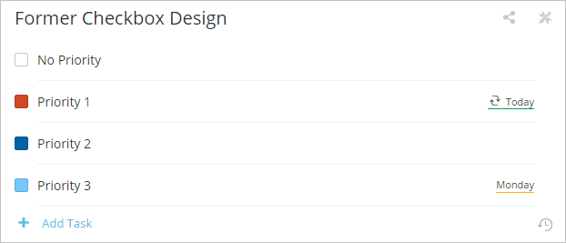

## Userscripts
My userscripts for Chrome, Greasemonkey etc.

### Todoist Theme

Brings back square checkboxes and former priority colors.

* [Install](https://github.com/darekkay/userscripts/raw/master/todoist-theme.user.js)

### NirvanaHQ Hotkeys Popup

Adds a button to NirvanaHQ, which opens a window with all available hotkeys and tags.

* [Install](https://github.com/darekkay/userscripts/raw/master/nirvanahq-hotkeys.user.js)
