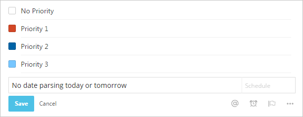

## Userscripts

Scripts which enhance the look and behavior of websites.

##### Installation

When using [**Tampermonkey**](https://chrome.google.com/webstore/detail/tampermonkey/dhdgffkkebhmkfjojejmpbldmpobfkfo) (Chrome) or [**Greasemonkey**](https://addons.mozilla.org/de/firefox/addon/greasemonkey/) (Firefox), just click "Install". To install a script in **Chrome** without Tampermonkey, go to `Settings > Extensions` and drop the `*.user.js` file into that browser tab.

### Todoist Enhancements

Brings back square checkboxes, former priority colors and turns off the date parser.

* [**Install**](https://github.com/darekkay/userscripts/raw/master/todoist-enhancements.user.js)

### NirvanaHQ Hotkeys Popup

Adds a button to NirvanaHQ, which opens a window with all available hotkeys and tags.

* [**Install**](https://github.com/darekkay/userscripts/raw/master/nirvanahq-hotkeys.user.js)
